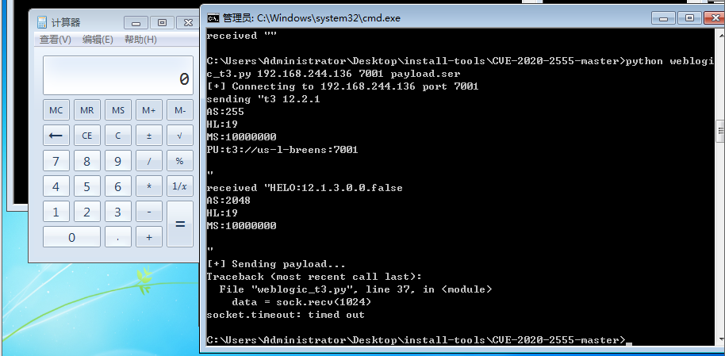
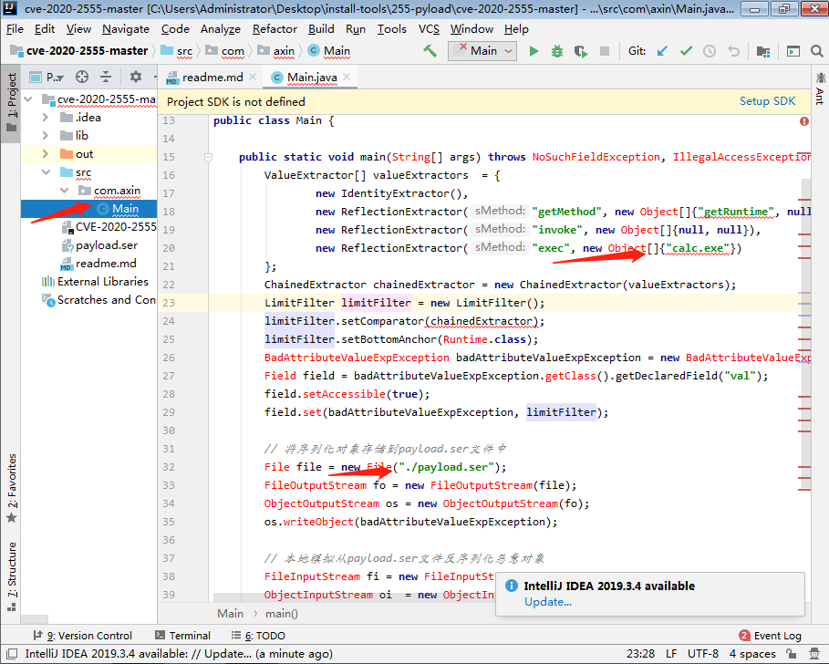

### 漏洞详情 ###

Oracle Coherence为Oracle融合中间件中的产品，在WebLogic 12c及以上版本中默认集成到WebLogic安装包中，T3是用于在WebLogic服务器和其他类型的Java程序之间传输信息的协议。

该漏洞允许未经身份验证的攻击者通过构造T3网络协议请求进行攻击，成功利用该漏洞可实现在目标主机上执行任意代码。使用了Oracle Coherence库的产品受此漏洞影响，在WebLogic Server 11g Release（10.3.4）及以上版本的安装包中默认集成了Oracle Coherence库。

### 影响版本 ###

Oracle Coherence 3.7.1.17

Oracle Coherence 12.1.3.0.0

Oracle Coherence 12.2.1.3.0

Oracle Coherence 12.2.1.4.0

### 漏洞利用 ###

漏洞利用工具：

payload生成(该git项目有已生成的payload可用，也可dump项目后本地根据自己需要修改命令)

    https://github.com/Maskhe/cve-2020-2555

如过想修改默认的命令，可通过以下方式

导入：ysoserialCoherence.jar包

导入：Main.java项目

### 修复方式 ###

升级补丁，参考oracle官网发布的补丁

https://www.oracle.com/security-alerts/cpujan2020.html

如果不依赖T3协议进行JVM通信，禁用T3协议

进入WebLogic控制台，在base_domain配置页面中，进入安全选项卡页面，点击筛选器，配置筛选器。在连接筛选器中输入：weblogic.security.net.ConnectionFilterImpl，在连接筛选器规则框中输入 7001 deny t3 t3s 保存生效（需重启）
